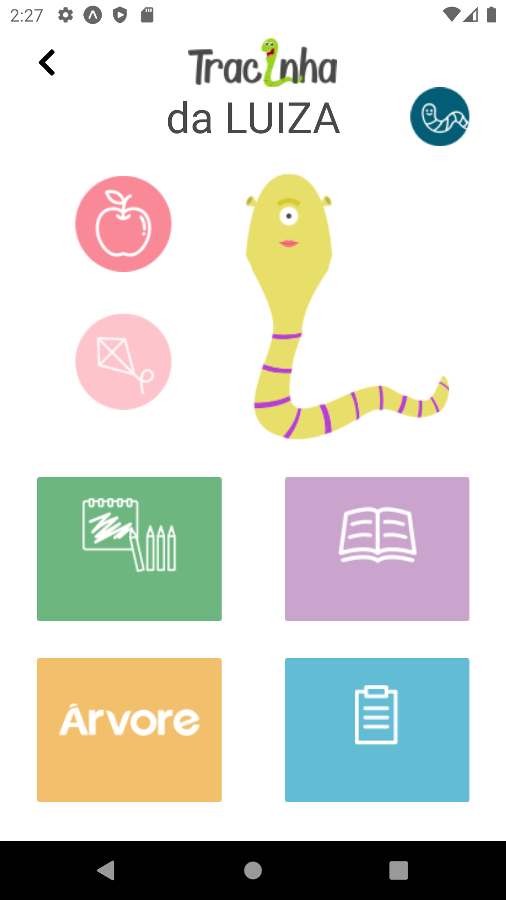

# Tracinha
<p>Tracinha, um projeto que nasceu no terceiro Mega Hackathon da Shawee, com o objetivo de atender ao desafio da Árvore Livros. A solução tem a proposta de fomentar a paixão pela leitura desdes os primeiros dias na formação do aluno, criando um ambiente interativo e colaborativo de leitura. </p>

   
  


# Geting started
- A partir de um terminal, acesse o diretório <b>/server/</b> e execute o comando abaixo. Este comando instalará todas as dependencias necessárias para o back-end:
```
npm install
```
- Ainda no diretório  <b>/server/</b>, execute o comando abaixo para iniciar o servidor local:
```
npx nodemon server.ts
```
- Agora, a partir da raiz do projeto acesse o diretório  <b>/mobile/</b> e execute o comando abaixo para instalar todas as dependências necessárias da camada mobile:
```
npm install
```
- Se o endereço ip de sua máquina for diferente de <b>192.168.0.10</b>,
acesse o arquivo <b>/mobile/src/services/api.ts</b> e substitua o valor de <b>baseURL</b> pelo valor do seu computador.
 ```
const api = axios.create({
	baseURL: 'http://192.168.0.10:3333/'
});
```
- Por fim, execute o comando abaixo para rodar a aplicação mobile:
```
expo start
```